## ESRGAN (Enhanced SRGAN) [:rocket: [BasicSR](https://github.com/xinntao/BasicSR)] [[Real-ESRGAN](https://github.com/xinntao/Real-ESRGAN)]

:sparkles: **New Updates.**

We have extended ESRGAN to [Real-ESRGAN](https://github.com/xinntao/Real-ESRGAN), which is a **more practical algorithm for real-world image restoration**. For example, it can also remove annoying JPEG compression artifacts. <br> You are recommended to have a try :smiley:

In the [Real-ESRGAN](https://github.com/xinntao/Real-ESRGAN) repo,

- You can still use the original ESRGAN model or your re-trained ESRGAN model. [The model zoo in Real-ESRGAN](https://github.com/xinntao/Real-ESRGAN#european_castle-model-zoo).
- We provide a more handy inference script, which supports 1) **tile** inference; 2) images with **alpha channel**; 3) **gray** images; 4) **16-bit** images.
- We also provide a **Windows executable file** `RealESRGAN-ncnn-vulkan` for easier use without installing the environment. This executable file also includes the original ESRGAN model.
- The full training codes are also released in the [Real-ESRGAN](https://github.com/xinntao/Real-ESRGAN) repo.

Welcome to open issues or open discussions in the [Real-ESRGAN](https://github.com/xinntao/Real-ESRGAN) repo.

- If you have any question, you can open an issue in the [Real-ESRGAN](https://github.com/xinntao/Real-ESRGAN) repo.
- If you have any good ideas or demands, please open an issue/discussion in the [Real-ESRGAN](https://github.com/xinntao/Real-ESRGAN) repo to let me know.
- If you have some images that Real-ESRGAN could not well restored, please also open an issue/discussion in the [Real-ESRGAN](https://github.com/xinntao/Real-ESRGAN) repo. I will record it (but I cannot guarantee to resolve it😛).

Here are some examples for Real-ESRGAN:

<p align="center">
  
</p>
:book: Real-ESRGAN: Training Real-World Blind Super-Resolution with Pure Synthetic Data

> [[Paper](https://arxiv.org/abs/2107.10833)] <br>
> [Xintao Wang](https://xinntao.github.io/), Liangbin Xie, [Chao Dong](https://scholar.google.com.hk/citations?user=OSDCB0UAAAAJ), [Ying Shan](https://scholar.google.com/citations?user=4oXBp9UAAAAJ&hl=en) <br>
> Applied Research Center (ARC), Tencent PCG<br>
> Shenzhen Institutes of Advanced Technology, Chinese Academy of Sciences

-----

As there may be some repos have dependency on this ESRGAN repo, we will not modify this ESRGAN repo (especially the codes).

The following is the original README:

#### The training codes are in :rocket: [BasicSR](https://github.com/xinntao/BasicSR). This repo only provides simple testing codes, pretrained models and the network interpolation demo.

[BasicSR](https://github.com/xinntao/BasicSR) is an **open source** image and video super-resolution toolbox based on PyTorch (will extend to more restoration tasks in the future). <br>
It includes methods such as **EDSR, RCAN, SRResNet, SRGAN, ESRGAN, EDVR**, etc. It now also supports **StyleGAN2**.

### Enhanced Super-Resolution Generative Adversarial Networks
By Xintao Wang, [Ke Yu](https://yuke93.github.io/), Shixiang Wu, [Jinjin Gu](http://www.jasongt.com/), Yihao Liu, [Chao Dong](https://scholar.google.com.hk/citations?user=OSDCB0UAAAAJ&hl=en), [Yu Qiao](http://mmlab.siat.ac.cn/yuqiao/), [Chen Change Loy](http://personal.ie.cuhk.edu.hk/~ccloy/)

We won the first place in [PIRM2018-SR competition](https://www.pirm2018.org/PIRM-SR.html) (region 3) and got the best perceptual index.
The paper is accepted to [ECCV2018 PIRM Workshop](https://pirm2018.org/).

:triangular_flag_on_post: Add [Frequently Asked Questions](https://github.com/xinntao/ESRGAN/blob/master/QA.md).

> For instance,
> 1. How to reproduce your results in the PIRM18-SR Challenge (with low perceptual index)?
> 2. How do you get the perceptual index in your ESRGAN paper?

#### BibTeX

    @InProceedings{wang2018esrgan,
        author = {Wang, Xintao and Yu, Ke and Wu, Shixiang and Gu, Jinjin and Liu, Yihao and Dong, Chao and Qiao, Yu and Loy, Chen Change},
        title = {ESRGAN: Enhanced super-resolution generative adversarial networks},
        booktitle = {The European Conference on Computer Vision Workshops (ECCVW)},
        month = {September},
        year = {2018}
    }

<p align="center">
  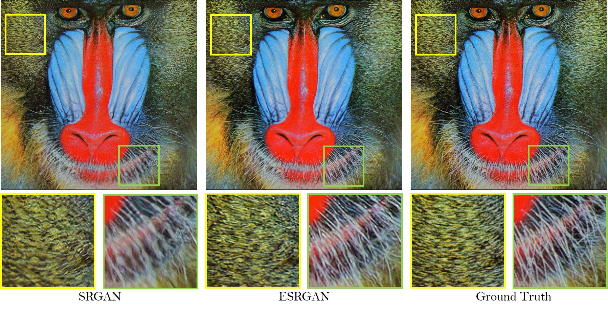
</p>

The **RRDB_PSNR** PSNR_oriented model trained with DF2K dataset (a merged dataset with [DIV2K](https://data.vision.ee.ethz.ch/cvl/DIV2K/) and [Flickr2K](http://cv.snu.ac.kr/research/EDSR/Flickr2K.tar) (proposed in [EDSR](https://github.com/LimBee/NTIRE2017))) is also able to achive high PSNR performance.

| <sub>Method</sub> | <sub>Training dataset</sub> | <sub>Set5</sub> | <sub>Set14</sub> | <sub>BSD100</sub> | <sub>Urban100</sub> | <sub>Manga109</sub> |
|:---:|:---:|:---:|:---:|:---:|:---:|:---:|
| <sub>[SRCNN](http://mmlab.ie.cuhk.edu.hk/projects/SRCNN.html)</sub>| <sub>291</sub>| <sub>30.48/0.8628</sub> |<sub>27.50/0.7513</sub>|<sub>26.90/0.7101</sub>|<sub>24.52/0.7221</sub>|<sub>27.58/0.8555</sub>|
| <sub>[EDSR](https://github.com/thstkdgus35/EDSR-PyTorch)</sub> | <sub>DIV2K</sub> | <sub>32.46/0.8968</sub> | <sub>28.80/0.7876</sub> | <sub>27.71/0.7420</sub> | <sub>26.64/0.8033</sub> | <sub>31.02/0.9148</sub> |
| <sub>[RCAN](https://github.com/yulunzhang/RCAN)</sub> |  <sub>DIV2K</sub> | <sub>32.63/0.9002</sub> | <sub>28.87/0.7889</sub> | <sub>27.77/0.7436</sub> | <sub>26.82/ 0.8087</sub>| <sub>31.22/ 0.9173</sub>|
|<sub>RRDB(ours)</sub>| <sub>DF2K</sub>| <sub>**32.73/0.9011**</sub> |<sub>**28.99/0.7917**</sub> |<sub>**27.85/0.7455**</sub> |<sub>**27.03/0.8153**</sub> |<sub>**31.66/0.9196**</sub>|

## Quick Test
#### Dependencies
- Python 3
- [PyTorch >= 1.0](https://pytorch.org/) (CUDA version >= 7.5 if installing with CUDA. [More details](https://pytorch.org/get-started/previous-versions/))
- Python packages:  `pip install numpy opencv-python`

### Test models
1. Clone this github repo.
```
git clone https://github.com/xinntao/ESRGAN
cd ESRGAN
```
2. Place your own **low-resolution images** in `./LR` folder. (There are two sample images - baboon and comic).
3. Download pretrained models from [Google Drive](https://drive.google.com/drive/u/0/folders/17VYV_SoZZesU6mbxz2dMAIccSSlqLecY) or [Baidu Drive](https://pan.baidu.com/s/1-Lh6ma-wXzfH8NqeBtPaFQ). Place the models in `./models`. We provide two models with high perceptual quality and high PSNR performance (see [model list](https://github.com/xinntao/ESRGAN/tree/master/models)).
4. Run test. We provide ESRGAN model and RRDB_PSNR model and you can config in the `test.py`.
```
python test.py
```
5. The results are in `./results` folder.
### Network interpolation demo
You can interpolate the RRDB_ESRGAN and RRDB_PSNR models with alpha in [0, 1].

1. Run `python net_interp.py 0.8`, where *0.8* is the interpolation parameter and you can change it to any value in [0,1].
2. Run `python test.py models/interp_08.pth`, where *models/interp_08.pth* is the model path.

<p align="center">
  
</p>

## Perceptual-driven SR Results

You can download all the resutls from [Google Drive](https://drive.google.com/drive/folders/1iaM-c6EgT1FNoJAOKmDrK7YhEhtlKcLx?usp=sharing). (:heavy_check_mark: included;  :heavy_minus_sign: not included; :o: TODO)

HR images can be downloaed from [BasicSR-Datasets](https://github.com/xinntao/BasicSR#datasets).

| Datasets |LR | [*ESRGAN*](https://arxiv.org/abs/1809.00219) | [SRGAN](https://arxiv.org/abs/1609.04802) | [EnhanceNet](http://openaccess.thecvf.com/content_ICCV_2017/papers/Sajjadi_EnhanceNet_Single_Image_ICCV_2017_paper.pdf) | [CX](https://arxiv.org/abs/1803.04626) |
|:---:|:---:|:---:|:---:|:---:|:---:|
| Set5 |:heavy_check_mark: | :heavy_check_mark: | :heavy_check_mark: | :heavy_check_mark:| :o: |
| Set14 | :heavy_check_mark: | :heavy_check_mark: | :heavy_check_mark: | :heavy_check_mark:| :o: |
| BSDS100 | :heavy_check_mark: | :heavy_check_mark: | :heavy_check_mark: | :heavy_check_mark:| :o: |
| [PIRM](https://pirm.github.io/) <br><sup>(val, test)</sup> | :heavy_check_mark: | :heavy_check_mark: | :heavy_minus_sign: | :heavy_check_mark:| :heavy_check_mark: |
| [OST300](https://arxiv.org/pdf/1804.02815.pdf) |:heavy_check_mark: | :heavy_check_mark: | :heavy_minus_sign: | :heavy_check_mark:| :o: |
| urban100 | :heavy_check_mark: | :heavy_check_mark: | :heavy_minus_sign: | :heavy_check_mark:| :o: |
| [DIV2K](https://data.vision.ee.ethz.ch/cvl/DIV2K/) <br><sup>(val, test)</sup> | :heavy_check_mark: | :heavy_check_mark: | :heavy_minus_sign: | :heavy_check_mark:| :o: |

## ESRGAN
We improve the [SRGAN](https://arxiv.org/abs/1609.04802) from three aspects:
1. adopt a deeper model using Residual-in-Residual Dense Block (RRDB) without batch normalization layers.
2. employ [Relativistic average GAN](https://ajolicoeur.wordpress.com/relativisticgan/) instead of the vanilla GAN.
3. improve the perceptual loss by using the features before activation.

In contrast to SRGAN, which claimed that **deeper models are increasingly difficult to train**, our deeper ESRGAN model shows its superior performance with easy training.

<p align="center">
  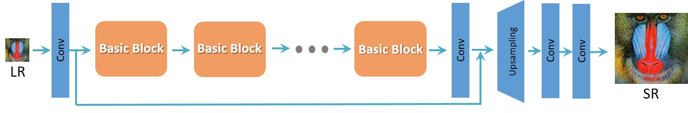
</p>
<p align="center">
  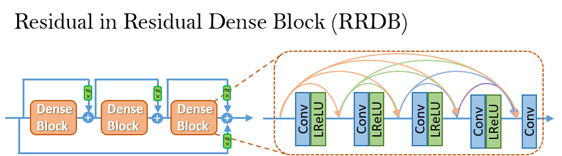
</p>

## Network Interpolation
We propose the **network interpolation strategy** to balance the visual quality and PSNR.

<p align="center">
  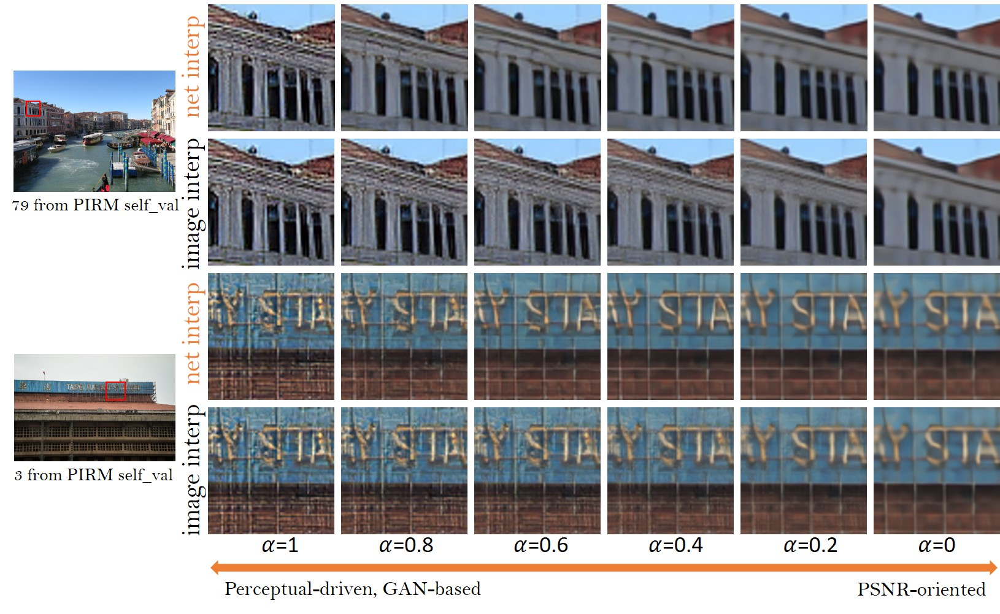
</p>

We show the smooth animation with the interpolation parameters changing from 0 to 1.
Interestingly, it is observed that the network interpolation strategy provides a smooth control of the RRDB_PSNR model and the fine-tuned ESRGAN model.

<p align="center">
  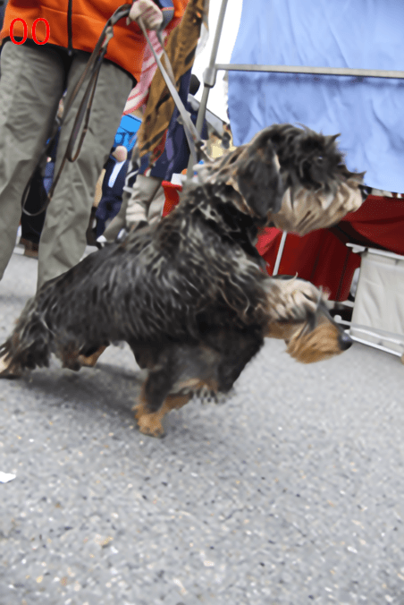
  &nbsp &nbsp
  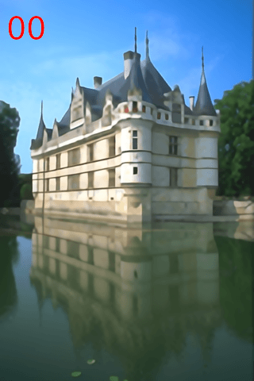
</p>

## Qualitative Results
PSNR (evaluated on the Y channel) and the perceptual index used in the PIRM-SR challenge are also provided for reference.

<p align="center">
  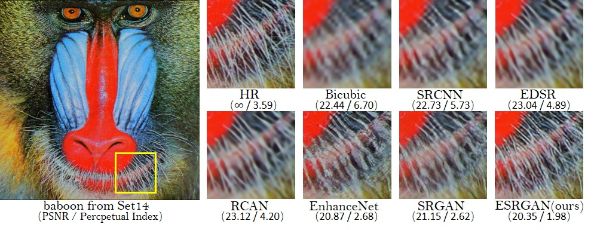
</p>
<p align="center">
  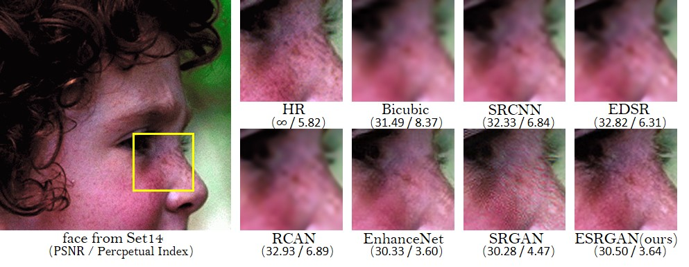
</p>
<p align="center">
  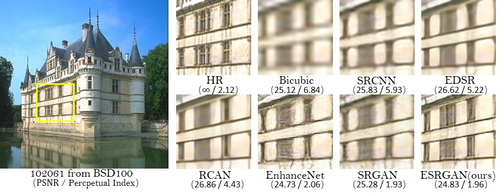
</p>
<p align="center">
  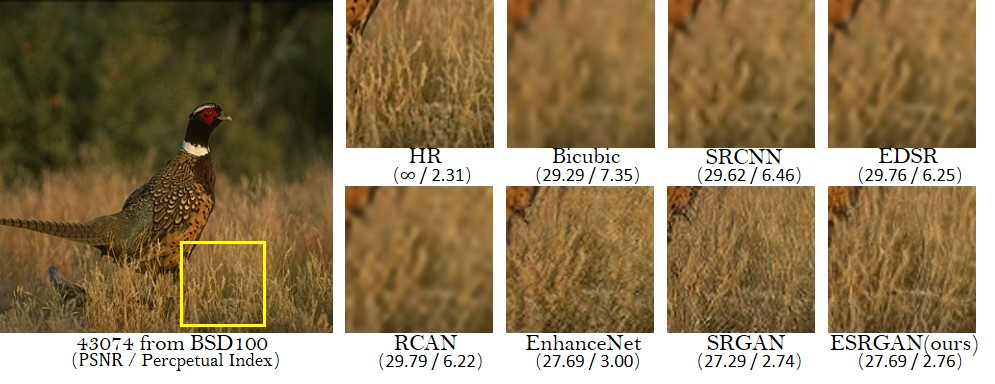
</p>

## Ablation Study
Overall visual comparisons for showing the effects of each component in
ESRGAN. Each column represents a model with its configurations in the top.
The red sign indicates the main improvement compared with the previous model.
<p align="center">
  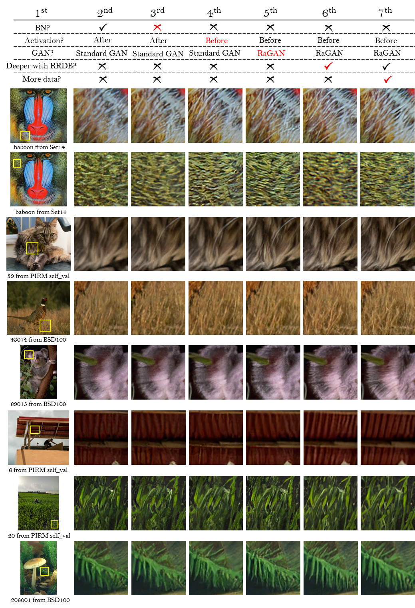
</p>

## BN artifacts
We empirically observe that BN layers tend to bring artifacts. These artifacts,
namely BN artifacts, occasionally appear among iterations and different settings,
violating the needs for a stable performance over training. We find that
the network depth, BN position, training dataset and training loss
have impact on the occurrence of BN artifacts.
<p align="center">
  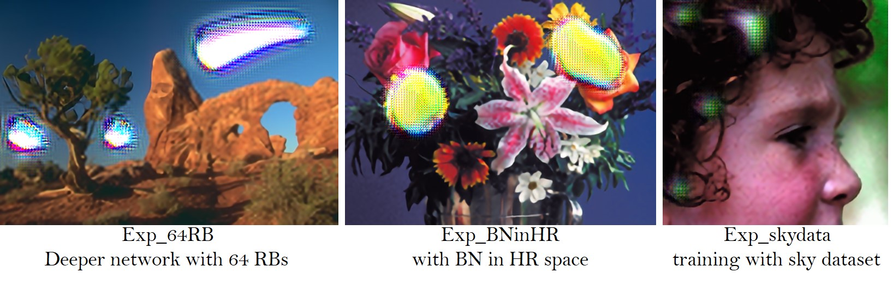
</p>

## Useful techniques to train a very deep network
We find that residual scaling and smaller initialization can help to train a very deep network. More details are in the Supplementary File attached in our [paper](https://arxiv.org/abs/1809.00219).

<p align="center">
  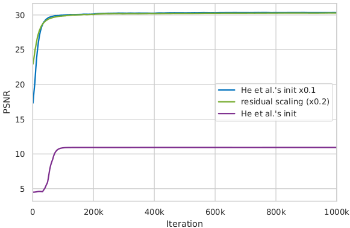
  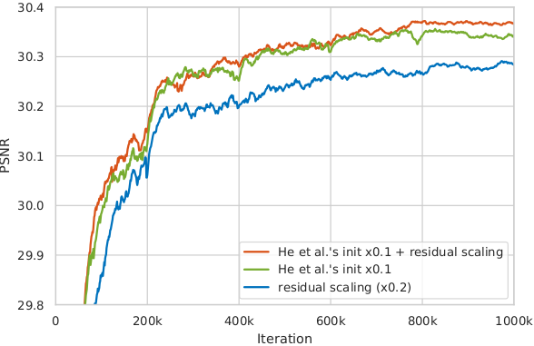
</p>

## The influence of training patch size
We observe that training a deeper network benefits from a larger patch size. Moreover, the deeper model achieves more improvement (∼0.12dB) than the shallower one (∼0.04dB) since larger model capacity is capable of taking full advantage of
larger training patch size. (Evaluated on Set5 dataset with RGB channels.)
<p align="center">
  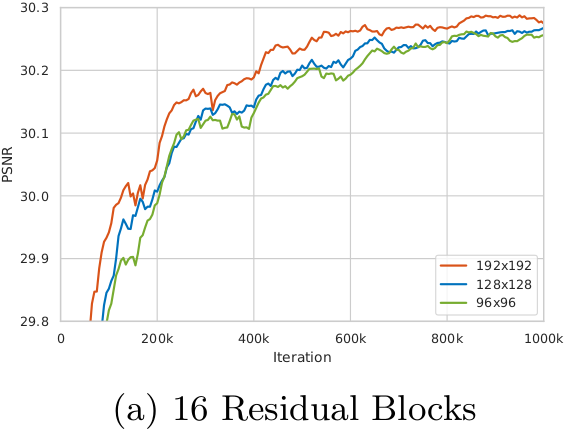
  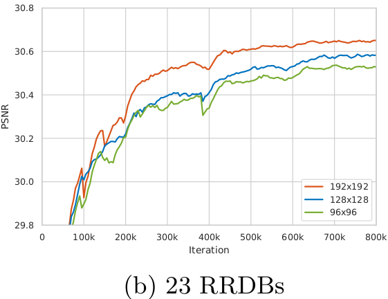
</p>
