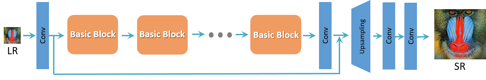
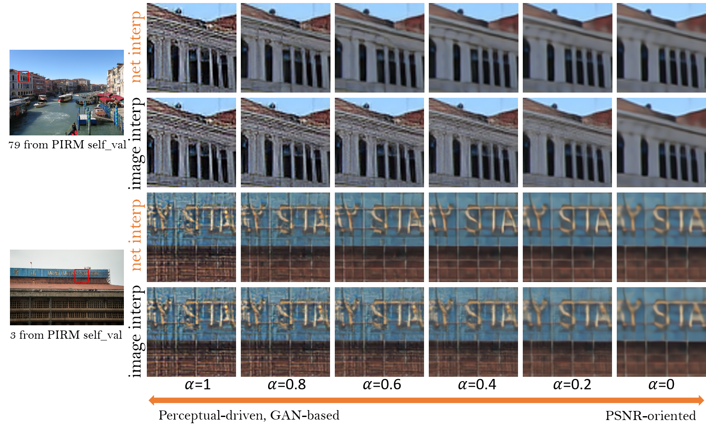
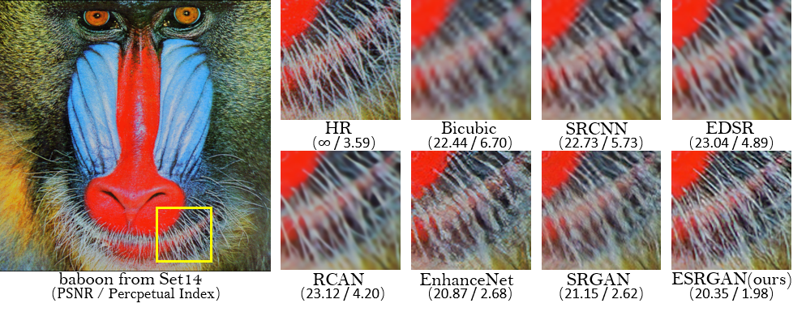
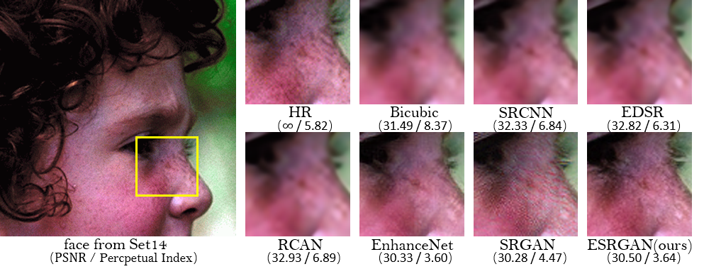
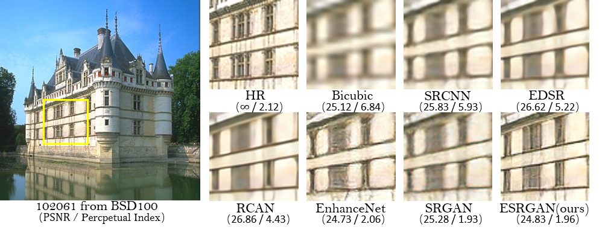
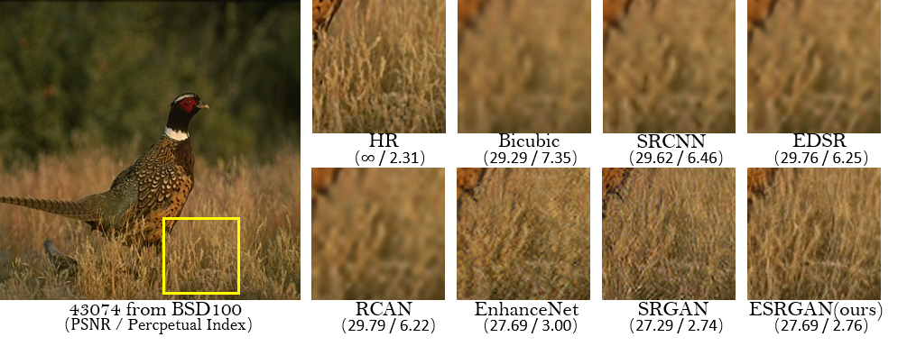
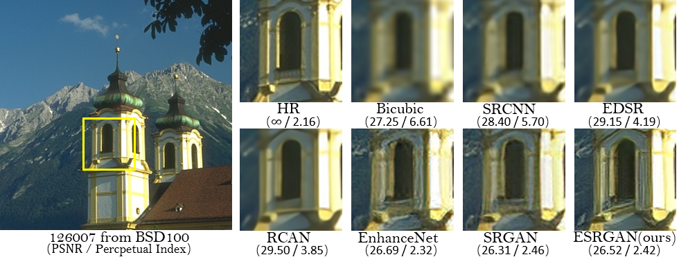
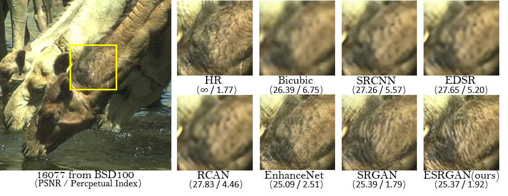

# ESRGAN (Enhanced SRGAN) [[Paper]](https://github.com/xinntao/ESRGAN) [[BasicSR]](https://github.com/xinntao/BasicSR)
## Enhanced Super-Resolution Generative Adversarial Networks
By Xintao Wang, [Ke Yu](https://yuke93.github.io/), Shixiang Wu, [Jinjin Gu](http://www.jasongt.com/), Yihao Liu, [Chao Dong](https://scholar.google.com.hk/citations?user=OSDCB0UAAAAJ&hl=en), [Chen Change Loy](http://personal.ie.cuhk.edu.hk/~ccloy/), [Yu Qiao](http://mmlab.siat.ac.cn/yuqiao/), [Xiaoou Tang](https://scholar.google.com/citations?user=qpBtpGsAAAAJ&hl=en)

This repo only provides simple testing codes and pretrained models. 

### :smiley: **For full training and testing codes, please refer to  [BasicSR](https://github.com/xinntao/BasicSR).**

We won the first place in [PIRM2018-SR competition](https://www.pirm2018.org/PIRM-SR.html) (region 3) and got the best perceptual index.
<!--pirm ECCV'2018 Workshop-->
### BibTeX
<!--
    @article{wang2018esrgan,
        author={Wang, Xintao and Yu, Ke and Wu, Shixiang and Gu, Jinjin and Liu, Yihao and Dong, Chao and Loy, Chen Change and Qiao, Yu and Tang, Xiaoou},
        title={ESRGAN: Enhanced super-resolution generative adversarial networks},
        journal={arXiv preprint arXiv:},
        year={2018}
    }
-->

  

                                             
## Introduction 
We improve the [SRGAN](https://arxiv.org/abs/1609.04802) from three aspects:
1. adopt a deeper model using Residual-in-Residual Dense Block (RRDB) without batch normalization layers.
2. employ [Relativistic average GAN](https://ajolicoeur.wordpress.com/relativisticgan/) instead of vanilla GAN.
3. improve the perceptual loss by using the features before activation.

In contrast to SRGAN, which claimed that **deeper models are increasingly difficult to train**, our deeper ESRGAN model shows its superior performance with easy training.

  

  

## Network Interpolation
We propose the **network interpolation strategy** to balance the visual quality and PSNR.

  

We show the smooth animation with the interpolation parameters changing from 0 to 1. 

  

  
  &nbsp &nbsp
  

  
## Qualitative Results
PSNR (evaluated on the luminance channel in YCbCr color space) and the perceptual index used in the PIRM-SR challenge are also provided for reference.

  

  

  

  

  

  

